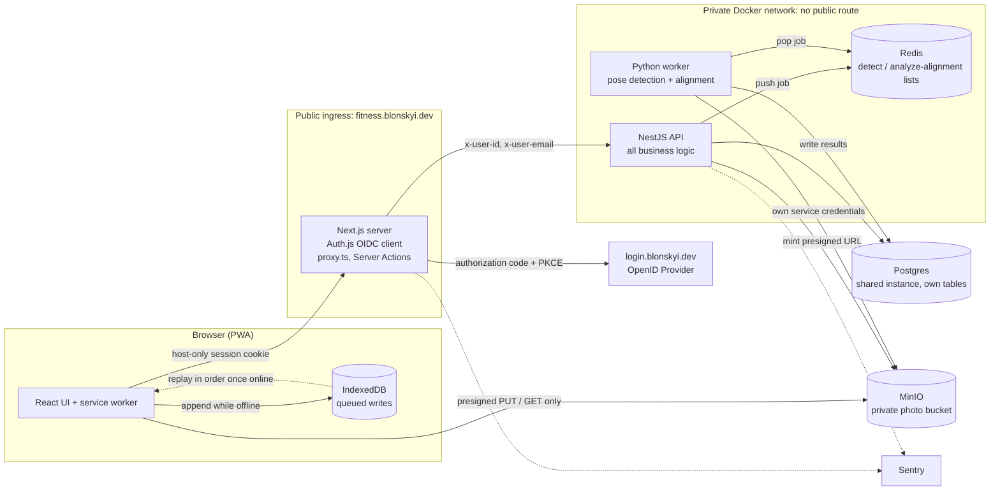
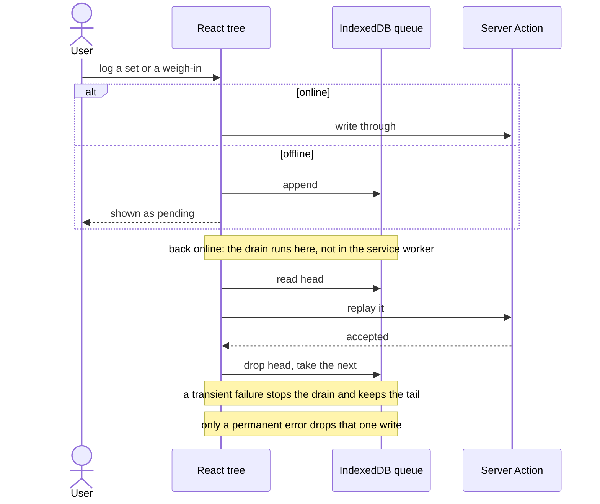
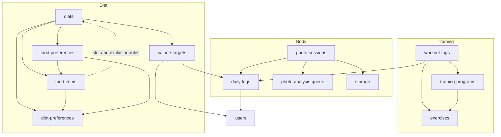
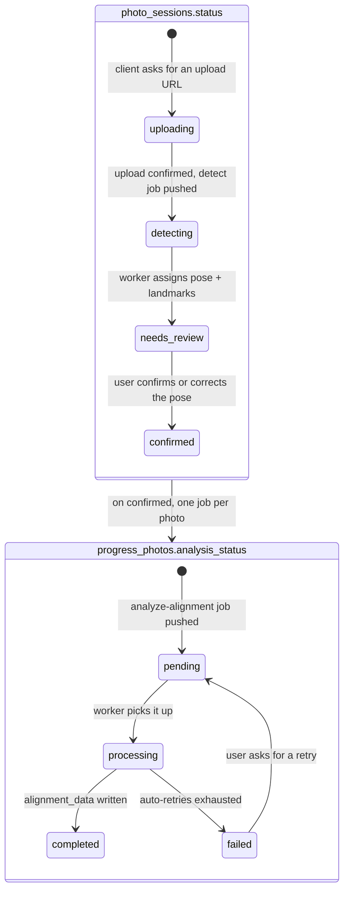
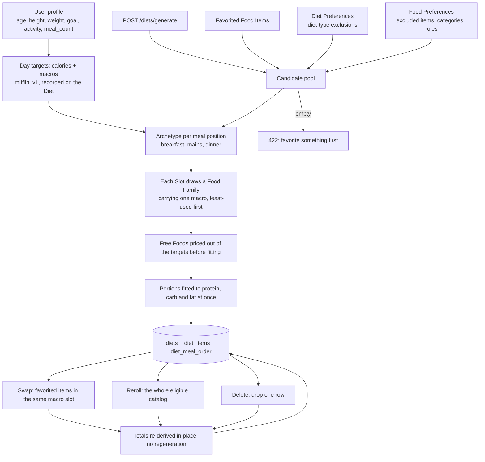
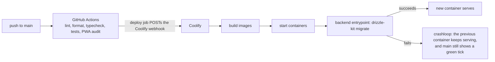
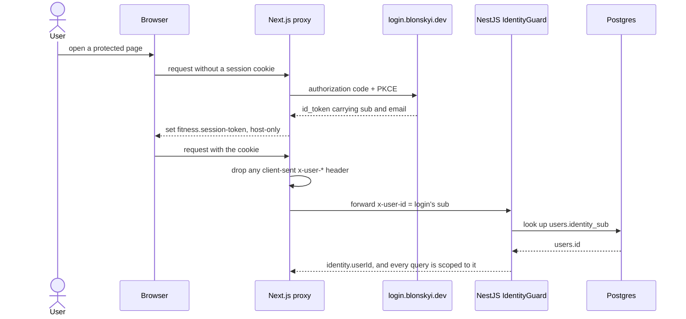

# Architecture

## Overview

fitness.blonskyi.dev — a fitness-tracking PWA: training programs/logs, a body-weight diary with progress photos, ML-based photo pose analysis, and a generated-diet recommendation engine. One of several `*.blonskyi.dev` subdomain pet projects sharing a Postgres instance and a common identity provider (`login.blonskyi.dev`), deployed via Coolify.

See [[domain-model]] and [[business-rules]] for the domain layer this architecture serves.

Full history and rationale behind these choices: `~/Documents/obsidian-notes/projects_history/fitness/docs/architecture.md`.

## System Diagram

The browser never reaches Postgres, Redis or the NestJS API. It talks to Next.js, and to MinIO only through a presigned URL Next.js asked the API to mint.

---

## Goals

- Full scope built in one pass (training, diet, photo analysis, i18n, offline PWA) — not phased as an MVP
- Reuse existing subdomain-project conventions (auth, deployment, Postgres) rather than inventing new ones
- Keep the photo-analysis and diet-generation pipelines simple and dependency-light (no new infra beyond what's justified)

---

## System Components

### Frontend

Next.js (App Router), TypeScript, TailwindCSS, next-intl (en/uk/ru/es), TanStack Virtual, service worker for PWA offline support. ShadCN and TanStack Query are deferred and not installed — see [ADR-009](docs/decisions.md). Zustand for client-only state that crosses a non-parent-child boundary or must live outside the React tree (e.g. the offline write-queue, FITNESS-13) — see [ADR-008](docs/decisions.md).

Responsibilities:

- All UI rendering and client-side interaction
- Runs its own Auth.js instance as an OIDC client of `login.blonskyi.dev` and forwards trusted identity headers to the backend (see Security below) — **no direct database access**, no Server Actions touching Drizzle/Postgres
- App-wide nav header (see [ADR-007](docs/decisions.md)) — a nav menu scoped to built sections, not a breadcrumb trail. Renders everywhere except `/onboarding`; includes a language switcher (FITNESS-11) — theme toggling is still not part of it
- Offline: the service worker caches active programs/exercises/recent logs for viewing; workout-set and weight writes queue in IndexedDB and flush to the API in order once back online. The flush runs in the React tree, not the service worker — see [[business-rules]] "PWA offline supports queued writes"

Dependencies:

- NestJS API (all reads/writes go through it)
- login (`login.blonskyi.dev`) as the OpenID Provider

Queued writes replay from the React tree, in order:

---

### Backend

NestJS, Drizzle ORM. **Sole owner of the database and business logic** — diet calculation, photo-analysis orchestration, food/exercise catalogs, training/workout domain logic.

Responsibilities:

- All Drizzle/Postgres access, with one module owning each table (see [ADR-027](docs/decisions.md))
- Generates presigned MinIO URLs for photo upload (client leg) and photo read (owner-only, short-lived — see Security)
- Enqueues photo-analysis jobs onto Redis; exposes an internal endpoint (or reads back) for worker results
- Trusts `x-user-id`/`x-user-email` headers forwarded by the frontend; never touches the session cookie or token itself. `x-user-id` carries login's `sub`, which `IdentityGuard` resolves to this app's own `users.id` via `users.identity_sub` (see [ADR-018](docs/decisions.md))

Dependencies:

- Postgres (shared instance, this project's own tables)
- Redis (job queue)
- MinIO (photo storage)

Module map. Every module sits behind `IdentityGuard` and reads the schema through `db`, so those edges are left out. `admin` is a back office over every table and is exempt from the ownership rule; the authoritative owner-per-table map is `backend/src/db/table-ownership.spec.ts`, which fails the build when a query is rooted outside its owner.

---

### Photo Analysis Worker

Python, FastAPI, OpenCV, MediaPipe, NumPy. Internal-only service, not exposed to the frontend.

Responsibilities:

- Consumes two job types from a plain Redis list (`detect`, `analyze-alignment` — see [ADR-013](docs/decisions.md)), each a JSON payload keyed by session/photo id and object key
- Reads photos directly from MinIO using its own service credentials (no presigned URL needed for this internal, service-to-service leg)
- Pose detection, pose/alignment validation, landmark extraction; writes results directly to Postgres with its own credentials
- Auto-retries a job a few times with backoff on transient failure

Dependencies:

- Redis (job source)
- MinIO (photo read)
- Postgres (result write)

---

### Integrations

External systems:

- login (`login.blonskyi.dev`) — the OpenID Provider this app authenticates against (authorization code + PKCE)
- MinIO (`s3.blonskyi.dev`) — object storage for progress photos, private bucket
- Open Food Facts / USDA FoodData Central — one-time curated seed import for the food catalog
- wger / ExerciseDB — one-time curated seed import for the exercise catalog
- A machine-translation API (e.g. DeepL/Google Translate) — used only at import time to seed per-locale food/exercise names, marked unverified for later review
- GitHub issues — ticket tracking for implementation, outside the runtime system (replaced the self-hosted Plane instance on 2026-09-15; its export is in `docs/tickets/`)

---

## Data Flow

**Photo upload + analysis:**

1. Client requests an upload URL from NestJS.
2. NestJS generates a presigned MinIO PUT URL.
3. Client uploads the image directly to MinIO (bypasses the app server).
4. Client confirms upload completion to NestJS.
5. NestJS creates the `photo_sessions` (`status = detecting`) and `progress_photos` rows, then pushes a `detect` job onto the Redis queue.
6. The Python worker picks up the job, fetches the photos from MinIO directly, assigns pose + landmarks, moves the session to `needs_review`.
7. The user reviews/edits pose and confirms; NestJS moves the session to `confirmed` and pushes an `analyze-alignment` job per photo.
8. The Python worker runs alignment analysis, writes `progress_photos.analysis_status`/`alignment_data` back.
9. Frontend polls/reads `analysis_status`; when reading a photo back, NestJS generates a short-lived presigned GET URL after checking ownership.

The two status columns that drive it, and who moves each one:

An ambiguous detection lands in `needs_review` with no pose assigned rather than failing, because only a human can settle it.

**Diet generation:** manual trigger only (see [[business-rules]]) → NestJS runs the greedy-heuristic generator against the user's profile, active Diet/Food Preferences, and the user's favorited Food Items, which are the whole candidate pool (ADR-025) → writes a new `diets` + `diet_items` row set scoped to the user, not to a day (see [ADR-022](docs/decisions.md)).

---

## Deployment

Docker Compose, deployed via Coolify (self-hosted) using a GitHub App for the private repo. On push to `main`: lint + tests (ESLint, Prettier, frontend/backend test suites) → the `deploy` job POSTs the Coolify webhook → Coolify builds and starts the containers, and the backend container runs `drizzle-kit migrate` as its own entrypoint before serving (see [ADR-005](docs/decisions.md)). A green CI run does not prove the release landed: a failed migration crashloops the new container, Coolify keeps the previous one serving, and `main` still shows a green tick. Shares its Postgres instance and Coolify host with the user's other `*.blonskyi.dev` pet projects.

---

## Security

Authentication:

The Next.js frontend is an OIDC client of `login.blonskyi.dev` (authorization code + PKCE, `client_id` `fitness`, redirect URI `/api/auth/callback/login`) — see [ADR-018](docs/decisions.md). It runs its own Auth.js instance with its own `AUTH_SECRET` and issues its own **host-only** session cookie (`fitness.session-token`, no `Domain`, httpOnly, `sameSite: lax`); nothing is shared with any other subdomain. The name is deliberately not Auth.js's default `authjs.session-token`: the Hub sets that name for `.blonskyi.dev`, and a same-named cookie sent alongside this app's would shadow it. `proxy.ts` reads that cookie and forwards trusted `x-user-id` (login's `sub`) / `x-user-email` headers to NestJS. NestJS is internal-only (private Docker network) and never validates the cookie itself.

Authorization:

Enforced by login at token issuance: it only issues a token once the user is approved site-wide and is a member of the `fitness` client, so a valid session already implies access and the frontend makes no separate allow/deny call. Within the app, all data is scoped to the resolved `users.id` — no cross-user data access.

Sign-out clears only this app's own cookie; login's IdP session is untouched.

Secrets Management:

`AUTH_SECRET` is this app's own, deliberately not shared with any other app; `OIDC_CLIENT_SECRET` is the `fitness` client's secret as registered with login. MinIO/Redis/Postgres credentials and the translation-API key are environment variables, not committed. Same for the Sentry DSN and the build-time Sentry auth token used to upload frontend source maps (see [[decisions]] ADR-006) — the auth token is a CI/build secret, not a runtime one, and only needs upload-project-scoped access.

Photo privacy: the MinIO bucket for progress photos is **private**. No permanent public URLs are ever stored or served — see [[business-rules]] "Progress photos are private."

---

## Observability

Error tracking:

Sentry (SaaS, free tier) — see [[decisions]] ADR-006. One Sentry org shared with the user's other `*.blonskyi.dev` pet projects; fitness is its own project within that org. `@sentry/nestjs` on the backend and `@sentry/nextjs` on the frontend (client- and server-side), active in production only — never during local `pnpm dev`, so local testing doesn't consume the shared org's event quota. Only unhandled exceptions and 5xx-class errors are reported; deliberately-thrown 4xx `HttpException`s (validation, 404, 401/403) are not. Events carry only the user's UUID as Sentry `user` context — `sendDefaultPii` is disabled and request bodies are scrubbed, so email, IP, and payload contents (which could include health data like weight or date of birth) never reach the third-party service. Alerting is Sentry's own built-in email notifications. Events are tagged with the deploying commit SHA as the Sentry release, and frontend source maps are uploaded at build time so stack traces resolve to real source, not minified bundle positions. One-off scripts (e.g. `seed-exercises.ts`) are out of scope — they're run interactively and watched, so a crash is already visible without a reporting layer. The Python photo-analysis worker is built, deployed and covered by CI's `worker-test` job, but has no Sentry integration; whether it gets one is still open. Until it does, a dead consumer thread in the worker fails silently.

General log management (structured application logs, aggregation, retention) is intentionally out of scope for now — a separate, deliberate decision when it's actually needed, not bundled into the error-tracking setup above.

Metrics:

Not yet decided.

Tracing:

Not yet decided.
